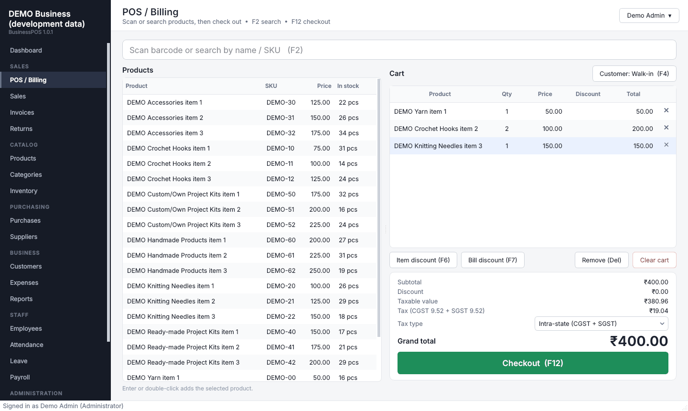
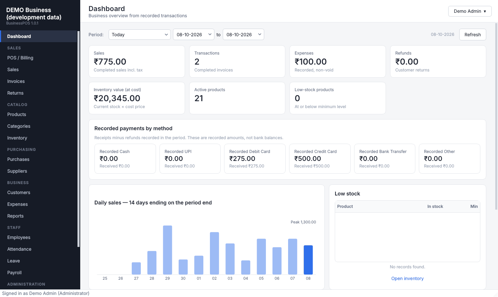
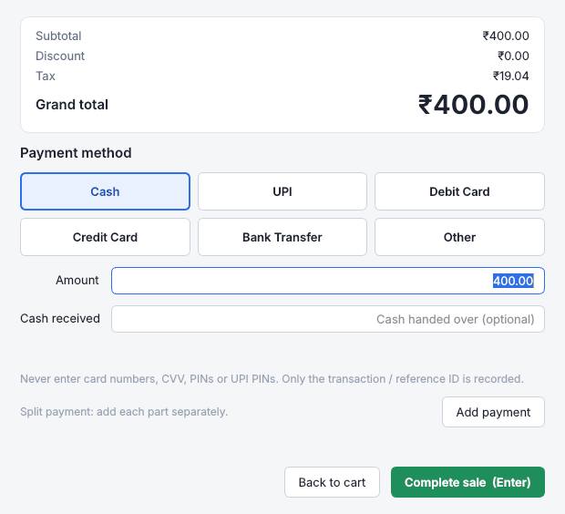
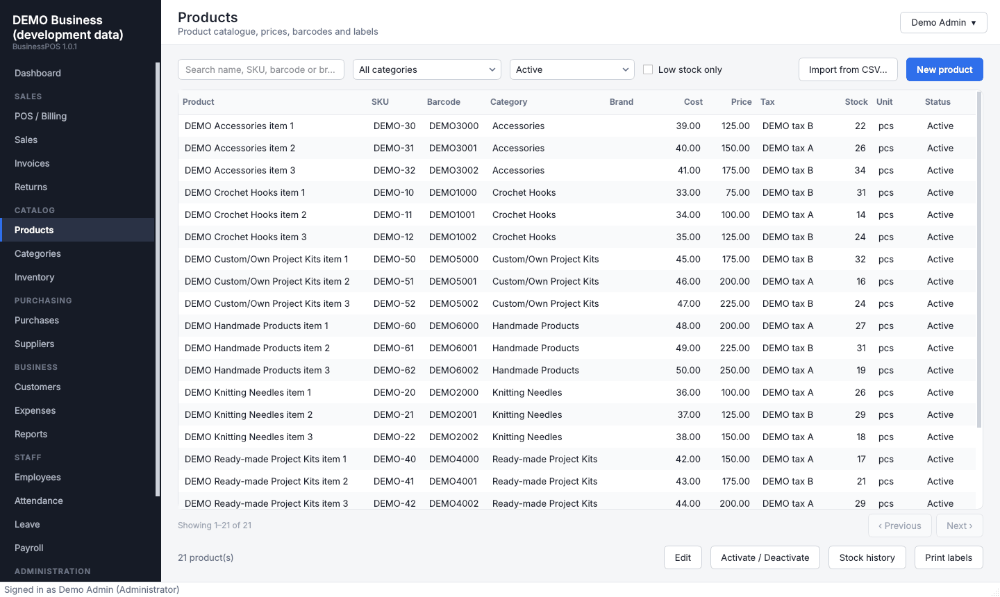
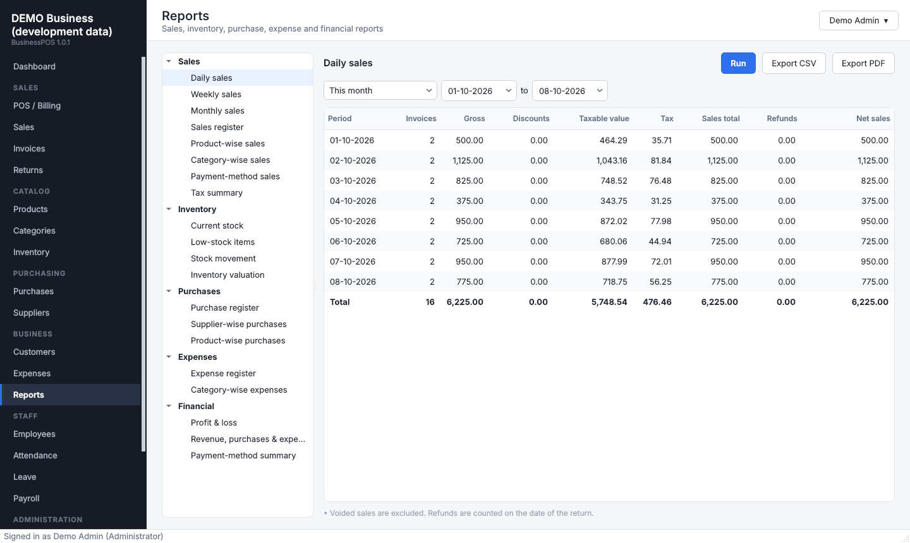

<div align="center">


# BusinessPOS

**Point of sale and business management for a Windows retail shop**

Billing · GST invoices · Stock · Purchases · Returns · Reports · Staff · Backups

[](https://github.com/yusufmj2005/YCH/actions/workflows/build.yml)

-0f172a)


[**Download**](https://github.com/yusufmj2005/YCH/releases/latest) ·
[Go-live checklist](docs/GO-LIVE-CHECKLIST.md) ·
[Acceptance test](docs/ACCEPTANCE-TEST.md) ·
[Changelog](CHANGELOG.md)

</div>

<p align="center"></p>

BusinessPOS is a desktop application that runs the day-to-day work of a retail
shop. It was built for a shop selling yarn, crochet hooks, knitting needles,
accessories, project kits and handmade products, but it is not tied to those
goods.

It runs **entirely on your own computer**: no subscription, no internet
connection, and no business data leaves the PC. You install it like any other
Windows program; you do not need Python or any technical tools.

---

## Contents

- [Highlights](#highlights)
- [Screenshots](#screenshots)
- [Getting started](#getting-started)
- [Everyday use](#everyday-use)
- [Your data is safe](#your-data-is-safe)
- [Features in detail](#features-in-detail)
- [Updating, uninstalling and recovery](#updating-uninstalling-and-recovery)
- [Known limitations](#known-limitations)
- [For developers](#for-developers)
- [Licence](#licence)

---

## Highlights

| | |
|---|---|
| 🧾 **Fast billing** | Scan or search, item and bill discounts, split payments (cash, UPI, cards, bank, custom). Keyboard shortcuts for every step. |
| 🏷️ **GST-ready invoices** | CGST + SGST or IGST, prices with or without tax, optional round-off, HSN codes. A4 and 80 mm receipt PDFs. Invoice numbers that are never reused. |
| 📦 **Accurate stock** | Every change is written to a stock ledger: sale, return, purchase, adjustment, void. Negative stock is blocked. Low-stock alerts. |
| 📥 **Quick set-up** | Import your whole product list and opening stock from Excel. Every row is checked before anything is saved. |
| ↩️ **Correct returns** | Returns only against the original invoice. Refunds add up exactly to what the customer paid. Damaged items can be kept out of stock. |
| 📊 **Reports that agree** | Sales, tax, stock, purchases, expenses, profit & loss. Exported to PDF and CSV. Automated tests check that every report agrees with the others. |
| 👥 **Staff and permissions** | Roles for Administrator, Manager, Cashier and Inventory Staff, with 37 separate permissions. Attendance, leave and payroll records. |
| 🔒 **Safe by design** | All-or-nothing transactions, a read-only audit log, records that can't be deleted, encrypted passwords and account lockout. |
| 💾 **Automatic backups** | Backups at start-up and when the app closes, plus an optional second copy on a USB drive or OneDrive / Google Drive. |

## Screenshots

| Dashboard | Checkout |
|---|---|
|  |  |
| **Products** | **Reports** |
|  |  |

<sub>Screenshots use generated demo data.</sub>

## Getting started

### Requirements

- Windows 10 or Windows 11, 64-bit
- Optional: a USB barcode scanner in keyboard (HID) mode, an A4 or 80 mm receipt
  printer, and a label printer

### 1. Download

Download **`BusinessPOS-Setup.exe`** from the
[latest release](https://github.com/yusufmj2005/YCH/releases/latest).

Each release also has a `.sha256` file. To confirm the download is intact, run
this in PowerShell and compare the result with that file:

```powershell
Get-FileHash .\BusinessPOS-Setup.exe -Algorithm SHA256
```

### 2. Install

Run the installer and accept the licence. Choose to install for all users or only
for yourself, and optionally create a desktop shortcut.

> **Windows SmartScreen** may say "Windows protected your PC" because the installer
> is not code-signed. Click **More info → Run anyway**.

### 3. First-time setup

On first launch a short wizard asks for:

1. Your business details: name, address, GSTIN and logo. These are printed on invoices.
2. An administrator account. Keep the password safe; it cannot be recovered.
3. Invoice numbering (prefix and starting number).
4. Your GST rates.
5. The payment methods you accept.

Everything can be changed later in **Settings**.

### 4. Before your first real sale

Work through the **[Go-live checklist](docs/GO-LIVE-CHECKLIST.md)**. It covers:

- user accounts
- importing your products
- setting up backups
- testing your printer and scanner
- the daily closing routine

Then run the **[Acceptance test](docs/ACCEPTANCE-TEST.md)** on the shop PC. It is a
step-by-step script with the exact amounts you should see.

## Everyday use

| When | What to do |
|---|---|
| **Opening** | Start BusinessPOS and sign in with your own account. A backup is made automatically. |
| **Selling** | **POS / Billing**: scan or search (F2), adjust quantities, apply discounts (F6/F7), choose a customer (F4) and check out (F12). Print or save the invoice. |
| **Returns** | **Returns**: find the original invoice, choose what is coming back and refund it. A return note can be printed. |
| **Receiving stock** | **Purchases**: record the supplier's delivery and complete it. Stock goes up and supplier payments are tracked. |
| **Closing** | **Reports → Daily sales** and **Payment-method sales**: match them against the cash drawer and your UPI/card statements. Closing the app makes a backup. |
| **Monthly** | Export **Profit & Loss** and **Tax summary** for your accountant. |

## Your data is safe

**All-or-nothing transactions.** A sale updates the invoice number, items,
payments, stock, stock ledger and audit log together, or not at all. A power cut
or an error can never leave a half-saved sale.

**Records can't be quietly changed.** Database triggers prevent deleting or
editing completed sales, payments, returns, stock movements, expenses and the
audit log, even outside the application. Mistakes are corrected openly: a voided
sale, a return or a stock adjustment, always with a reason and the user's name.

**Exact money.** Amounts are stored as whole paise, never as floating-point
numbers, so totals always add up to the paisa.

**Backups.**
- An automatic backup when the app starts (once a day) and every time it closes.
- An optional **second copy folder**, so a copy survives if the PC fails or is
  stolen. You are warned if that folder is unavailable.
- Manual backups to any folder or USB drive.
- Every backup is verified before it is kept.
- **Restore** checks the file first, makes a safety backup of the current data,
  and asks you to type `RESTORE` to confirm.

**Security.**
- Passwords are stored as bcrypt hashes.
- An account locks for 5 minutes after 5 wrong passwords.
- Passwords set by an administrator must be changed at first sign-in.
- Optional automatic sign-out when the PC is left idle.
- Card numbers are refused if typed into a payment reference.

## Features in detail

<details>
<summary><b>Show the full feature list</b></summary>

| Area | What is included |
|---|---|
| Sign-in & security | Username/password sign-in, bcrypt hashing, lockout after 5 failed attempts, forced password change for admin-set passwords, optional auto sign-out after inactivity |
| First-time setup | Wizard for business details and logo, administrator account, invoice numbering, tax rates and payment methods. Nothing is pre-filled with business data |
| Dashboard | Sales, transactions, expenses, refunds, inventory value, active and low-stock products, payments by method, 14-day sales chart, recent sales and purchases, date filter |
| POS / Billing | Search or scan (USB keyboard-wedge scanners), quantity edits, item and bill discounts (amount or %), CGST/SGST or IGST, optional round-off, walk-in or named customer, keyboard shortcuts |
| Payments | Cash, UPI, Debit Card, Credit Card, Bank Transfer, Other and custom methods. Optional reference ID. Split payments; totals must equal the invoice. Card-number-like references are rejected |
| Invoices | Unique, gap-free numbering with configurable prefix and start number. A4 and 80 mm receipt PDFs. Printing through Windows printers, reprint, save as PDF |
| Sales | Filters by date, customer, payment method and status. Controlled voiding (permission + reason; stock restored; payments voided; number never reused) |
| Returns | Against the original invoice only; can't exceed what is still returnable. Pro-rata refund including tax. The return that completes an invoice also gives back the invoice round-off, so refunds equal the amount paid. Split refunds; "not restocked" for damaged items; return note PDF |
| Products & categories | **Bulk import from CSV/Excel** (validated, all-or-nothing). Create, edit, search, filter, deactivate. Unique SKU and barcode, HSN/SAC, cost/selling price, tax rate, prices with or without tax, units, fractional quantities, minimum stock, product image |
| Barcodes & labels | Manual entry or generated (Code 128 or EAN-13 with in-store prefix 20–29). Label sheets: A4 3×8, A4 4×10, single-label printers |
| Inventory | Ledger of every change (purchase, sale, return, adjustment in/out, sale void, purchase cancel). Adjustments (add, remove, set to counted quantity) with a required reason. Low-stock alerts, valuation. Negative stock blocked by default |
| Purchases & suppliers | Draft → complete (adds stock) → cancel (reverses stock). Discounts, tax, optional cost-price update. Supplier payments with paid/partial/unpaid status. Supplier history |
| Customers | Customer records and purchase history, net of refunds |
| Expenses | Configurable categories, payment method, reference, voiding with reason |
| Reports | Daily/weekly/monthly sales, sales register, product/category/payment-method sales, tax summary, current and low stock, stock movement, valuation, purchase registers, expense reports, profit & loss, monthly revenue/purchases/expenses, payment-method summary. CSV and PDF export |
| Staff | Employees, daily attendance, leave (configurable types, approve/reject), internal payroll records with optional posting to expenses |
| Users & permissions | Users and editable roles (Administrator, Manager, Cashier, Inventory Staff); 37 permissions enforced in the business logic, not just by hiding buttons |
| Audit log | Sign-ins, sales, voids, returns, purchases, stock adjustments, price changes, settings, users, permissions, backups and restores. Read-only |
| Backup & restore | Automatic backups at start-up and on close, optional second copy folder, manual backups, integrity validation, typed confirmation, safety backup before every restore |

**How profit & loss is calculated**

- **Net sales** = taxable value of completed sales − taxable value of returns + net invoice round-off.
- **Cost of goods sold** = cost price recorded on each sale line − cost of returned items put back into stock.
- **Gross profit** = Net sales − COGS.
- **Net profit** = Gross profit − non-void expenses in the period (including salaries posted from payroll).
- Purchases are shown for information only; they become cost through COGS when sold.
- GST collected is a liability, not revenue.
- Inventory is valued at the current cost price.

BusinessPOS supports your bookkeeping. It is not a statutory accounting package.
Confirm tax treatment with your accountant.

</details>

## Updating, uninstalling and recovery

**Where your data lives.** Data is stored per Windows user, not in the program
folder:

```
%LOCALAPPDATA%\BusinessPOS\
    database\businesspos.db    all business data
    backups\                   automatic, manual, pre-restore and pre-upgrade backups
    logs\                      businesspos.log (no passwords or card data)
    attachments\               logo and product images
    exports\                   invoices, return notes, labels and reports you generated
```

**Updating.**
1. Download the newer `BusinessPOS-Setup.exe` and run it.
2. The installer replaces only the program files and keeps your data.
3. On first start, the new version makes a `pre-upgrade` backup and then upgrades
   the database in place.

**Uninstalling.** Use *Settings → Apps → BusinessPOS → Uninstall*. Your data is
**kept** unless you answer *Yes* to two separate confirmation questions.

**Moving to a new PC, or after a PC failure.**
1. Install BusinessPOS on the new PC and complete the setup wizard with any
   details; they will be replaced.
2. Open **Backup & Restore → Restore** and choose your latest backup, for example
   from the second copy folder.
3. Sign in with your usual accounts.

**Forgotten password.** Another administrator can reset it in
**Users & Permissions**. Keep a second administrator account for this reason.

## Known limitations

- **Not included:**
  - credit or partially-paid sales (every sale is fully paid at checkout)
  - customer store credit
  - returns to suppliers (a completed purchase can only be cancelled as a whole)
  - returns without the original invoice
- **No payment processing:** UPI, card and bank methods record how the customer
  paid. BusinessPOS doesn't connect to payment terminals or gateways.
- **Tax:** no GST e-invoicing (IRN/QR), e-way bills or return-filing exports. The
  rates are the ones you configure.
- **Payroll** is record-keeping only. There are no PF, ESI, professional tax or TDS
  calculations.
- **Inventory valuation** uses the current cost price, not FIFO or weighted average.
- **One computer:** SQLite on a single PC, one signed-in user at a time. There is no
  multi-counter network mode or cloud sync.
- **Backups are not encrypted.** Keep copies somewhere secure.
- **Unsigned installer:** Windows SmartScreen may warn on first run.
- **Hardware:** scanners must use keyboard (HID) mode. Printing uses standard
  Windows printer drivers. Specific printer and scanner models have not been
  certified; check yours with the acceptance test.

---

## For developers

<details>
<summary><b>Architecture, development, testing, building and releasing</b></summary>

### Architecture

```
app/
├── main.py              entry point: single instance, logging, startup and automatic backups
├── bootstrap.py         builds the Database and all services (no Qt; used by tests and tools)
├── selftest.py          packaged-build self test (BusinessPOS.exe --self-test)
├── config/              constants (permissions, roles, enums) and runtime paths
├── database/            engine/session, scaled-decimal types, migrations, system seed data
├── models/              SQLAlchemy ORM models, one file per domain
├── security/            bcrypt hashing, CurrentUser and permission checks
├── validators/          input normalisation and validation
├── services/            all business logic and permission checks
├── reports/             report container and CSV/PDF exporters
├── printing/            invoice, return-note and label PDFs; printing via QtPdf
├── barcode/             barcode values (EAN-13 check digit, Code 128)
├── backup/              backup, validation, restore, second-copy folder
├── ui/                  PySide6 windows, pages, dialogs, widgets and theme
└── utils/               money/date helpers, logging, single-instance mutex
tests/                   pytest suite (162 tests)
tools/                   icon generator, version info, demo data, screenshots (development only)
installer/installer.iss  Inno Setup script
build/                   build_app.bat, build_installer.bat, clean_build.bat
.github/workflows/       automated test, build, install-test and release
```

- **Layers.** The UI calls services. Every service method runs in one transaction
  (`Database.session()`, `BEGIN IMMEDIATE`), checks permissions with
  `require(actor, Perm.X)` and writes its audit entry in the same transaction.
- **Money.** All amounts are `Decimal`, stored as integer paise or thousandths
  (`ScaledDecimal`).
- **Database guards.** SQLite triggers forbid deleting or editing financial
  records and the audit log. Unique and check constraints protect keys and
  amounts.
- **Schema versions.** A new database is created at the current version. An older
  database is backed up and migrated step by step (`app/database/migrations`). A
  newer database is refused. To change the schema:
  1. Edit the models.
  2. Add `_m000N` and register it in `MIGRATIONS`.
  3. Bump `SCHEMA_VERSION`.

### Development setup

Requires Windows 10/11 x64 and Python 3.12 (3.11+ works). Building the installer
also needs Inno Setup 6.

```bat
py -3.12 -m venv .venv
.venv\Scripts\python -m pip install -r requirements-lock.txt
set BUSINESSPOS_DATA_DIR=%CD%\.devdata
.venv\Scripts\python -m app.main
```

Always set `BUSINESSPOS_DATA_DIR` during development, so a real shop database is
never touched. To load sample data labelled "DEMO", run
`.venv\Scripts\python tools\demo_seed.py`. It refuses to run against the
production folder.

### Testing

```bat
.venv\Scripts\python -m pytest -q
.venv\Scripts\python -m ruff check .
```

The suite runs offscreen and covers:

- the pricing engine: tax-inclusive and exclusive prices, CGST/SGST/IGST, discounts, allocation and round-off
- every sale, return, void, purchase and stock path, with rollback on errors
- **reconciliation of a full business day across every report, the dashboard and the stock ledger**
- permissions and administrator safeguards
- backups, restore, the second copy folder and paths with special characters
- database migrations, including upgrading a real v1 database and restoring a v1 backup
- CSV import, including Excel encodings and all-or-nothing behaviour
- PDF invoices, return notes and labels
- the setup wizard, sign-in, lockout and forced password change
- smoke tests that every page loads

`pytest.ini` turns leaked database handles into failures.

### Building

```bat
build\build_installer.bat
```

This script:
1. cleans the previous build
2. installs the pinned dependencies
3. runs the tests
4. builds `dist\BusinessPOS\BusinessPOS.exe` with PyInstaller (one-folder build)
5. runs the packaged self-test
6. compiles `installer_output\BusinessPOS-Setup.exe` with Inno Setup

### Continuous integration and releases

Every push runs [`.github/workflows/build.yml`](.github/workflows/build.yml):

1. Lint and the full test suite on Linux.
2. On Windows: the complete build script, then a **silent install of the produced
   installer**, a self-test of the installed program and a silent uninstall.
3. The installer and its SHA-256 are uploaded as the `BusinessPOS-Setup` artifact.

**To publish a release:**
1. Set `APP_VERSION` in `app/config/constants.py`.
2. Add a section for that version to `CHANGELOG.md`.
3. Push a tag such as `v1.0.2`.

The workflow checks that the tag matches `APP_VERSION`, builds and verifies the
installer, and publishes a GitHub Release. The release notes come from the
changelog, and the installer and checksum are attached. Installers are never
committed to the repository.

</details>

## Licence

BusinessPOS is **proprietary software**. Copyright © 2026 yusufmj2005. All rights
reserved. See [LICENSE](LICENSE).

It includes open-source components (Qt / PySide6, SQLAlchemy, ReportLab, bcrypt,
Pillow and others) under their own licences. See
[THIRD-PARTY-NOTICES.md](THIRD-PARTY-NOTICES.md).
